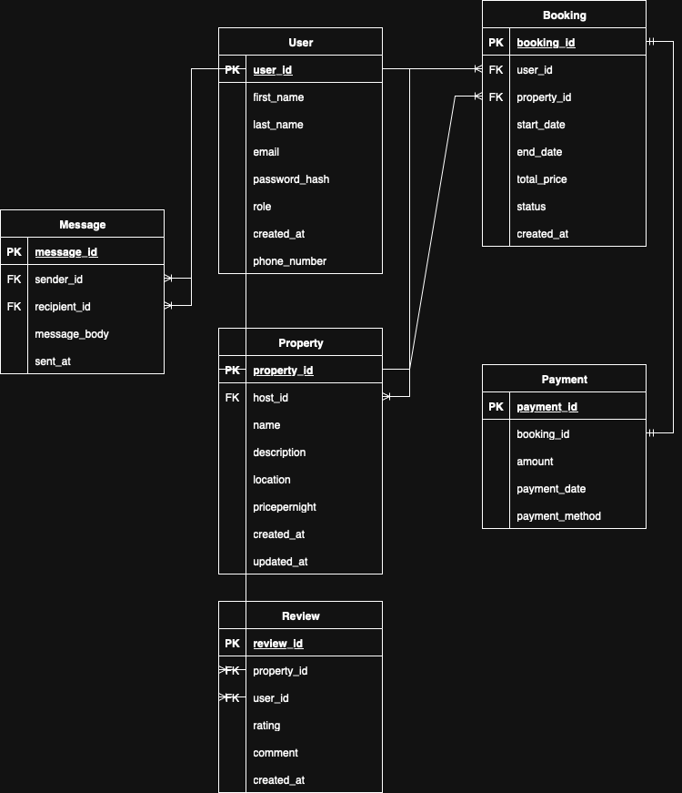

# Normalization

Image: 

# Database Normalization to 3NF

This document explains how normalization principles were applied to the given relational schema to ensure that all entities conform to **Third Normal Form (3NF)**. Normalization reduces data redundancy and improves data integrity.

---

## 🔁 Normalization Principles Recap

### ✅ First Normal Form (1NF)
- Ensure atomic values (no arrays, lists, or composite fields)
- Ensure each record is uniquely identifiable using a primary key
- Eliminate repeating groups or multi-valued attributes

### ✅ Second Normal Form (2NF)
- Be in 1NF
- Eliminate **partial dependencies** — all non-key attributes must depend on the whole primary key (particularly relevant in tables with composite primary keys)

### ✅ Third Normal Form (3NF)
- Be in 2NF
- Eliminate **transitive dependencies** — non-key attributes must depend only on the primary key and not on other non-key attributes

---

## 🧩 Normalization Review of Each Entity

### 🧍 User Table

User (
  user_id PK,
  first_name,
  last_name,
  email,
  password_hash,
  phone_number,
  role,
  created_at
)
1NF: All fields are atomic
2NF: user_id is the only key, all other fields depend entirely on it
3NF: No transitive dependencies exist
✅ Conclusion: Already in 3NF
🏠 Property Table
Property (
  property_id PK,
  host_id FK → User(user_id),
  name,
  description,
  location,
  price_per_night,
  created_at,
  updated_at
)
1NF: All fields are atomic
2NF: All fields depend entirely on property_id
3NF: No non-key attribute depends on another non-key attribute
✅ Conclusion: Already in 3NF
📌 Optional Enhancement: If location values are repetitive (e.g. city names), you can normalize it into a separate Location table.
📅 Booking Table
Booking (
  booking_id PK,
  property_id FK,
  user_id FK,
  start_date,
  end_date,
  total_price,
  status,
  created_at
)
1NF: All attributes are atomic
2NF: All non-key attributes depend on booking_id
3NF: No transitive dependencies
✅ Conclusion: Already in 3NF
💳 Payment Table
Payment (
  payment_id PK,
  booking_id FK → Booking(booking_id),
  amount,
  payment_date,
  payment_method
)
1NF: Fields are atomic
2NF: All fields depend on payment_id
3NF: No transitive dependencies
✅ Conclusion: Already in 3NF
📌 Optional: Normalize payment_method into a separate table for extensibility.
✍️ Review Table
Review (
  review_id PK,
  property_id FK,
  user_id FK,
  rating,
  comment,
  created_at
)
1NF: Atomic fields
2NF: All fields depend on review_id
3NF: No transitive dependency
✅ Conclusion: Already in 3NF
💬 Message Table
Message (
  message_id PK,
  sender_id FK,
  recipient_id FK,
  message_body,
  sent_at
)
1NF: Atomic
2NF: All fields depend on message_id
3NF: No non-key to non-key dependency
✅ Conclusion: Already in 3NF
